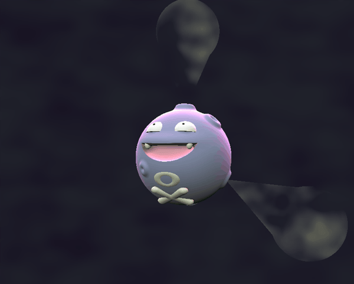

# CIS 566 Project 1: Implicit Surfaces

Charles Wang\
PennKey: chawang

This project is a look into Koffing paradise. Hang out with Koffing in a [live demo](http://charlesliwang.com/homework-2-implicit-surfaces-charlesliwang/).

## Project Features

### Koffing! Created with SDFs

And you can toggle whether or not you want to hang out with all of Koffing's cousins that unfortunately can't emit smoke. They know when to step back and let Koffing shine. 

### Volume Ray Marching

An sdf surface (constructed with cones and spheres) is first raymarched as the bounds of the smoke.\
With the initial t value calculated (and the max t value if there is an sdf behind it), the volume with perlin-defined density is raymarched. The scale/position of the sdf bound animates and the perlin is offset each frame in the direction of the sdf.

### Ambient Occlusion and Subsurface Scattering

Ambient Occlusion is implemented as [IQ has in this demo](https://www.shadertoy.com/view/Xds3zN), but is primarily used to calculate a thickness approximation for [this SSS approximation](https://colinbarrebrisebois.com/2011/03/07/gdc-2011-approximating-translucency-for-a-fast-cheap-and-convincing-subsurface-scattering-look/).

## References
- [IQ sdf reference](http://iquilezles.org/www/articles/distfunctions/distfunctions.htm)
- [IQ Shadertoy example](https://www.shadertoy.com/view/Xds3zN)
- [Real Time Subsurface Scattering shader](https://colinbarrebrisebois.com/2011/03/07/gdc-2011-approximating-translucency-for-a-fast-cheap-and-convincing-subsurface-scattering-look/)
- [Volume Ray Marching](http://shaderbits.com/blog/creating-volumetric-ray-marcher)
